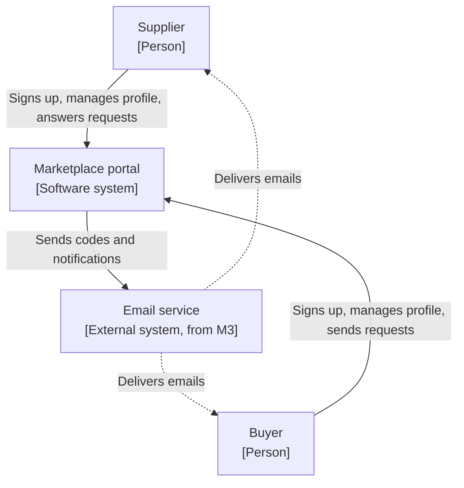
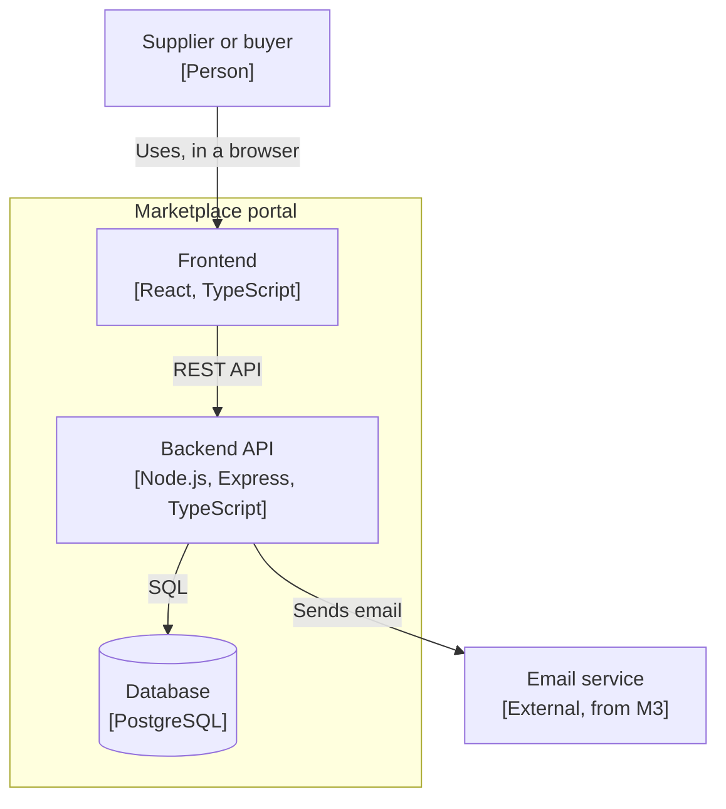

# Architecture overview

## Goals

A portal for a made-up B2B marketplace. Suppliers and buyers sign up through an onboarding wizard, then manage their details in an account editor once they're active. Later milestones add a proper login and a directory where buyers can send requests to suppliers.

What each milestone adds:

- M1: start as a supplier or buyer, then go through four steps (contact details, company details, supplier or buyer details, then consent and submit) to onboard and activate the account.
- M2: edit everything through the same forms once the account is active. A demo account so reviewers can look around without signing up. A second theme, switched from the header, to show the theming works through design tokens alone.
- M3: log in with a password and an emailed code. Password reset goes through the same code step.
- M4: buyers browse suppliers and send requests. Suppliers accept or decline. Contact details are only shown once a request is accepted.

## Requirements

1. Easy to try out. A reviewer can see the app working within a few minutes without typing through the whole wizard. Each step has a button that fills it with sample data, only a few fields are required, and from M2 a seeded demo account skips onboarding altogether.
2. Compartmentalisation. Each form section is self-contained, with its fields, rules and storage kept together. A section can be added or changed without touching the others, and each milestone adds features without reworking earlier ones.
3. Validation always on. Each step is validated when Continue is pressed, first in the browser for quick feedback and then on the server, which is the final check. A submitted application is always complete. The server checks are covered by API tests.
4. Resumable. Progress is saved at each step, so a user can leave and come back to where they left off.
5. Own data only. Users can only see and change their own account. Another organisation's contact details are only shown once a request has been accepted.
6. Themeable. Brand-specific values (colours, fonts, radius, spacing) come from design tokens, so switching theme needs token changes only. Components can still be customised, as long as they take these values from tokens.
7. Safe as a public demo. No real data is needed, and nothing one visitor types is shown to another.

## Constraints

- The stack is fixed: TypeScript, React, Node.js with Express, and PostgreSQL. Showing that stack is the reason the project exists.
- Hosting needs to be free or cheap, so features are weighed against the hosting's capabilities and limits before being added.

## Context

Who uses the portal and what it depends on. The email service is the only outside system, and it comes in with login in M3.

The frontend calls a REST API on the backend. Emails go out through the email provider's API.

## Solution strategy

The form is split into sections (contact, company and so on). Each section is defined once, with its fields and validation rules, in shared code used by both the frontend and the backend. The onboarding wizard and the account editor are built from the same section definitions and use the same save path.

Validation runs in the browser for quick feedback and again in the API on every save, and the whole application is re-checked on submit.

A session exists from the first screen, before there's any login. Every request works on the account in the session, never on an id sent from the browser. Adding login in M3 changes how the session is created, not the rest of the API.

Express serves both the built frontend and the API, so the whole app is a single service with a managed Postgres database. Merges to main deploy automatically.

The UI uses shadcn/ui components themed with design tokens, rather than custom-built components. The second theme is a set of token overrides.

Tool choices are recorded in the decision log. The full tech list is in the project brief.

## Building blocks

- Frontend: runs in the browser. Start screen, onboarding wizard, account editor, and later the login and request screens.
- Backend API: serves the built frontend as well as the REST API. Sessions, validation, saving and submitting, and later login and requests.
- Database: accounts, users, profiles and sessions. Later one-time codes and requests.

## Main flow: saving a step

The core flow of the system. Saving a tab in the account editor works the same way, without moving on to a next step.

1. The user fills in a step and presses Continue.
2. The frontend checks it against the shared rules. If anything's wrong, errors show on the fields and nothing is sent.
3. If it passes, the section is sent to the API.
4. The API checks the session and runs the same rules again. If they fail, field errors are sent back and shown the same way as the frontend's own.
5. If they pass, the API saves the section and records the user's progress.
6. The frontend moves to the next step.

The sample data button only fills the form in the browser. Saving still goes through the steps above.

The other flows are simpler. Starting an application creates the account, the user and the session together. Resuming asks the API who the session belongs to and opens the wizard at the step the user reached. Submitting loads the whole application from the database, checks all of it, and only then marks the account active.

Login and request flows get added here when M3 and M4 are designed.

## Deployment

Production is a single Render web service running the API, which also serves the built frontend. The database is on Neon.

Every pull request runs lint, type checks, tests and a build in GitHub Actions, and must pass before merging. Merging to main deploys to Render. Database migrations run when the service starts.

Local development uses Postgres in Docker.

## Cross-cutting concepts

The data, at a high level. Field lists are still open and will be settled in M1.

- Account: the organisation. Supplier or buyer, onboarding or active, company details, how far through onboarding it is, and consent to the terms.
- User: the person who signed up. One per account for now. Kept separate from the account because login (M3) and contact details (M4) belong to the person, and more than one user per account is on the backlog.
- Supplier profile and buyer profile: the details specific to each type.
- Session.
- Later: one-time codes (M3) and connection requests (M4).

Validation errors from the API come back in one format that maps onto the form fields, so they show up the same way as frontend errors. Unexpected errors show a generic message with a reference id, and the details go to the log.

Sessions are cookie based from the first screen and stay that way after login, so they need CSRF protection throughout. The approach will go in the decision log.

For accessibility, every field has a proper label, with its help and error text linked to it. When a step won't save, focus moves to the first field with a problem.

Testing covers the section rules with unit tests, the API with tests against a real Postgres database, and the forms with component and accessibility tests, plus one end-to-end test through the whole app. The API tests don't mock the database, since saving data is the core of the system.

Theming uses design tokens in three layers: base values from the Figma kit, the values components actually read (background, primary and so on), and a few for states like an invalid field.

The demo is public, so the site tells people not to enter real details. Only seeded suppliers are listed in the directory, so every request a visitor sends goes to seeded data and nothing one visitor types is shown to another. Demo accounts reset when opened. How the shared demo supplier account handles incoming requests is decided when M4 is designed.

## Decisions

Key decisions are kept in a decision log, `docs/decisions.md`. Planned so far:

- Stack, repo layout and hosting (M0)
- One form definition for the wizard and the editor (M1)
- Identity before login (M1)
- Login design (M3)
- Connection requests (M4)